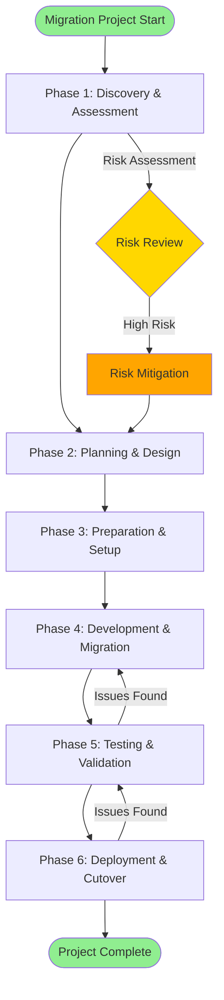
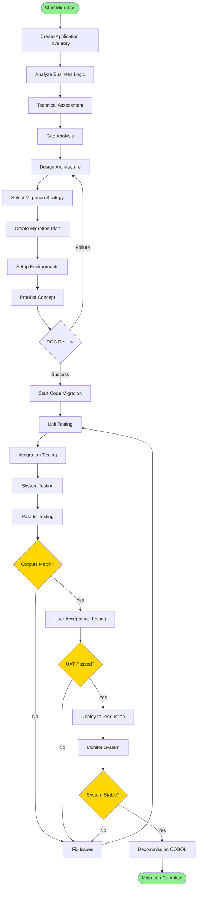
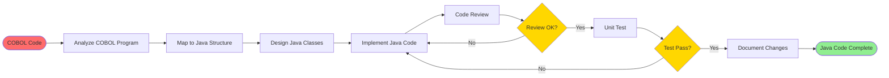
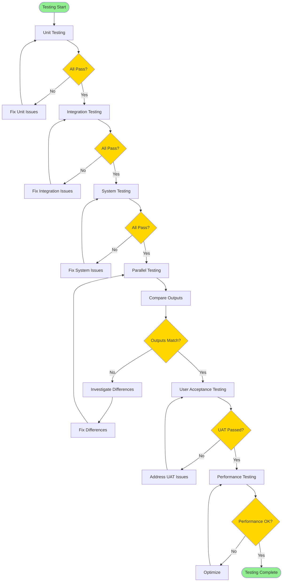
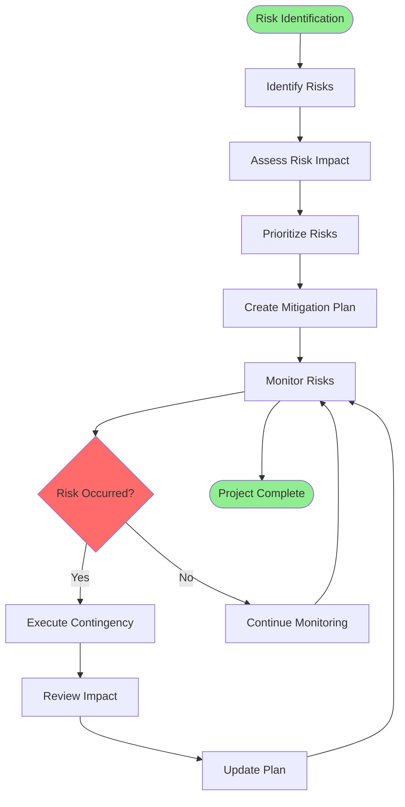
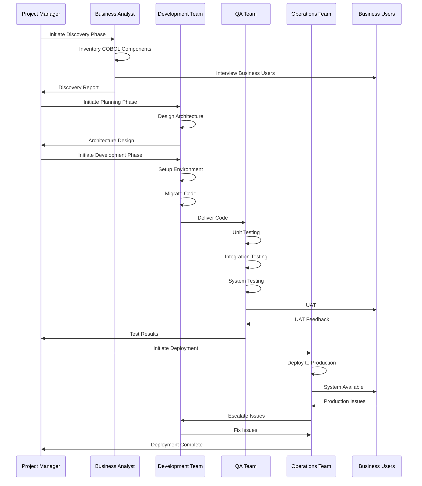
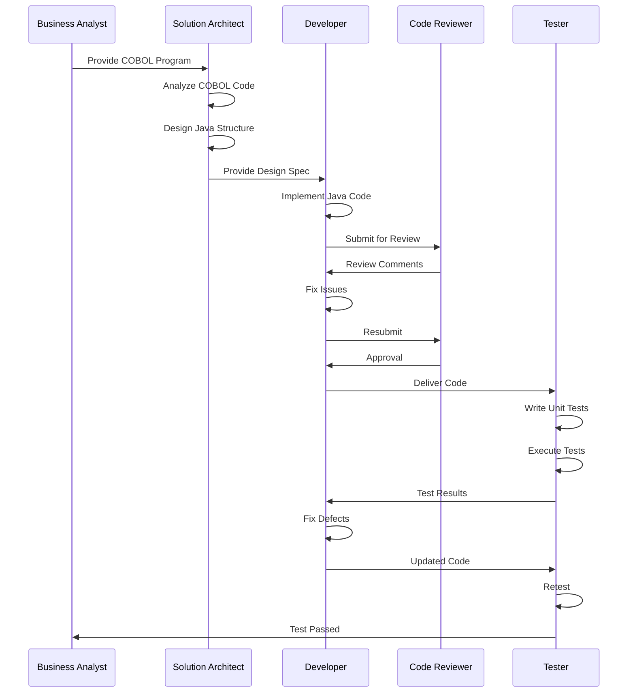
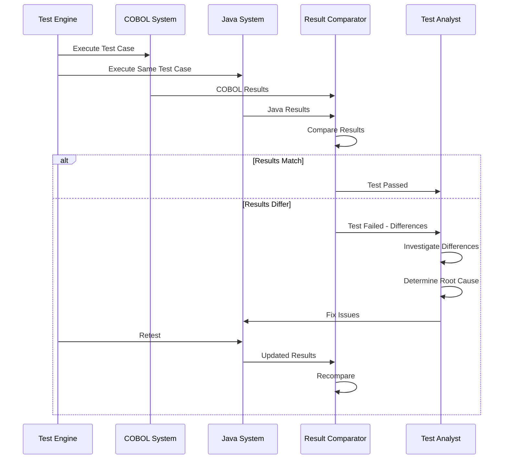
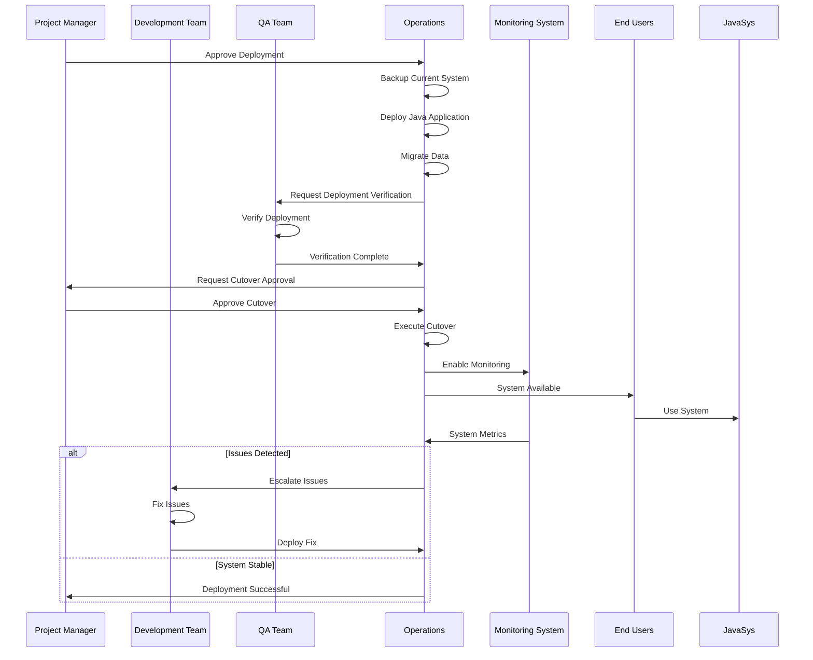

# COBOL to Java Migration Strategy

## Executive Summary

This document outlines a comprehensive strategy for migrating a COBOL application to Java. The migration process is complex and requires careful planning, analysis, and execution to ensure business continuity, data integrity, and system reliability.

**Key Objectives:**
- Minimize business disruption
- Maintain functional equivalence
- Improve maintainability and extensibility
- Reduce long-term operational costs
- Modernize technology stack

**Migration Approach:**
- Phased migration with parallel running
- Incremental delivery
- Risk mitigation through testing
- Knowledge transfer and documentation

---

## Table of Contents

1. [Migration Phases Overview](#migration-phases-overview)
2. [Detailed Migration Steps](#detailed-migration-steps)
3. [Process Flowcharts](#process-flowcharts)
4. [Sequence Diagrams](#sequence-diagrams)
5. [Documentation Strategy](#documentation-strategy)
6. [Risk Management](#risk-management)
7. [Additional Recommendations](#additional-recommendations)
8. [Success Criteria](#success-criteria)

---

## Migration Phases Overview

The migration is divided into six major phases:

1. **Discovery and Assessment** (4-8 weeks)
2. **Planning and Design** (6-10 weeks)
3. **Preparation and Setup** (4-6 weeks)
4. **Development and Migration** (12-24 weeks)
5. **Testing and Validation** (8-12 weeks)
6. **Deployment and Cutover** (4-8 weeks)

**Total Estimated Duration: 38-68 weeks (9-17 months)**

---

## Detailed Migration Steps

### Phase 1: Discovery and Assessment

#### Step 1.1: Application Inventory
- **Objective**: Create comprehensive inventory of all COBOL components
- **Activities**:
  - Identify all COBOL programs, copybooks, and JCL scripts
  - Document file structures (VSAM, sequential, indexed)
  - Map database dependencies (DB2, IMS, VSAM)
  - Identify external system integrations
  - Document batch job schedules and dependencies
  - List all configuration files and parameters
- **Deliverables**:
  - Application inventory spreadsheet
  - Component dependency map
  - File structure documentation
  - Integration point list

#### Step 1.2: Business Process Analysis
- **Objective**: Understand business logic and workflows
- **Activities**:
  - Interview business users and subject matter experts
  - Document business rules and calculations
  - Map business processes to COBOL programs
  - Identify critical business functions
  - Document regulatory and compliance requirements
- **Deliverables**:
  - Business process documentation
  - Business rules catalog
  - Critical function matrix
  - Compliance requirements document

#### Step 1.3: Technical Assessment
- **Objective**: Evaluate technical complexity and migration effort
- **Activities**:
  - Analyze code complexity metrics
  - Identify reusable components
  - Assess data migration complexity
  - Evaluate integration complexity
  - Review performance requirements
  - Assess security requirements
- **Deliverables**:
  - Technical assessment report
  - Complexity analysis
  - Effort estimation
  - Risk assessment

#### Step 1.4: Gap Analysis
- **Objective**: Identify gaps between COBOL and Java capabilities
- **Activities**:
  - Map COBOL features to Java equivalents
  - Identify unsupported features
  - Design workarounds for gaps
  - Plan for decimal precision handling
  - Plan for file I/O migration
- **Deliverables**:
  - Gap analysis document
  - Feature mapping matrix
  - Workaround design document

### Phase 2: Planning and Design

#### Step 2.1: Architecture Design
- **Objective**: Design target Java architecture
- **Activities**:
  - Design application architecture (layered, microservices, etc.)
  - Select technology stack (Spring Boot, Java EE, etc.)
  - Design database schema (if migrating from mainframe DB)
  - Design API interfaces
  - Plan for cloud deployment (if applicable)
- **Deliverables**:
  - Architecture design document
  - Technology stack selection document
  - Database design document
  - API specification

#### Step 2.2: Migration Strategy Selection
- **Objective**: Choose appropriate migration approach
- **Options**:
  - **Big Bang**: Complete migration in one go
  - **Strangler Fig Pattern**: Gradual replacement
  - **Parallel Running**: Run both systems simultaneously
  - **Lift and Shift**: Minimal changes, direct port
  - **Rewrite**: Complete redesign
- **Deliverables**:
  - Migration strategy document
  - Approach justification
  - Timeline and milestones

#### Step 2.3: Data Migration Strategy
- **Objective**: Plan data migration approach
- **Activities**:
  - Design data extraction strategy
  - Plan data transformation rules
  - Design data validation approach
  - Plan for data synchronization during migration
  - Design rollback strategy
- **Deliverables**:
  - Data migration plan
  - Data mapping document
  - Validation strategy
  - Rollback procedures

#### Step 2.4: Testing Strategy
- **Objective**: Define comprehensive testing approach
- **Activities**:
  - Design unit testing strategy
  - Plan integration testing
  - Design system testing approach
  - Plan user acceptance testing
  - Design performance testing
  - Plan regression testing
- **Deliverables**:
  - Test strategy document
  - Test plan
  - Test case templates
  - Test data requirements

### Phase 3: Preparation and Setup

#### Step 3.1: Environment Setup
- **Objective**: Establish development and testing environments
- **Activities**:
  - Set up Java development environment
  - Configure build tools (Maven/Gradle)
  - Set up CI/CD pipelines
  - Configure testing frameworks
  - Set up code repositories
  - Configure development tools (IDEs, code analyzers)
- **Deliverables**:
  - Environment setup guide
  - Development standards document
  - CI/CD pipeline configuration

#### Step 3.2: Team Preparation
- **Objective**: Prepare development team
- **Activities**:
  - Train COBOL developers on Java
  - Train Java developers on business domain
  - Establish coding standards
  - Set up code review process
  - Create knowledge sharing sessions
- **Deliverables**:
  - Training plan
  - Coding standards document
  - Code review checklist

#### Step 3.3: Tool Selection and Setup
- **Objective**: Select and configure migration tools
- **Activities**:
  - Evaluate automated migration tools (if applicable)
  - Set up code analysis tools
  - Configure testing tools
  - Set up monitoring and logging tools
  - Configure project management tools
- **Deliverables**:
  - Tool evaluation report
  - Tool configuration guide

#### Step 3.4: Proof of Concept (POC)
- **Objective**: Validate migration approach with small component
- **Activities**:
  - Select representative component
  - Migrate component to Java
  - Test migrated component
  - Validate approach and tools
  - Document lessons learned
- **Deliverables**:
  - POC report
  - Lessons learned document
  - Approach validation

### Phase 4: Development and Migration

#### Step 4.1: Code Migration
- **Objective**: Convert COBOL code to Java
- **Activities**:
  - Migrate data structures (copybooks to Java classes)
  - Convert COBOL programs to Java classes/methods
  - Implement business logic
  - Handle file I/O operations
  - Implement database operations
  - Handle batch processing
- **Deliverables**:
  - Migrated Java code
  - Code migration log
  - Technical debt register

#### Step 4.2: Data Access Layer Development
- **Objective**: Implement data access in Java
- **Activities**:
  - Implement database access layer (JPA/Hibernate)
  - Create data models
  - Implement file I/O operations
  - Handle legacy data formats
  - Implement data validation
- **Deliverables**:
  - Data access layer code
  - Data model documentation

#### Step 4.3: Business Logic Implementation
- **Objective**: Implement business rules in Java
- **Activities**:
  - Implement business logic layer
  - Handle decimal precision (use BigDecimal)
  - Implement calculations
  - Implement validation rules
  - Handle business workflows
- **Deliverables**:
  - Business logic code
  - Business rules documentation

#### Step 4.4: Integration Development
- **Objective**: Implement system integrations
- **Activities**:
  - Implement API clients
  - Implement message queue handlers
  - Handle legacy system interfaces
  - Implement file transfer mechanisms
  - Handle real-time integrations
- **Deliverables**:
  - Integration code
  - Integration documentation

#### Step 4.5: User Interface Development (if applicable)
- **Objective**: Develop user interfaces
- **Activities**:
  - Design UI/UX (if replacing green screens)
  - Develop web interfaces
  - Develop mobile interfaces (if needed)
  - Implement reporting features
- **Deliverables**:
  - UI/UX designs
  - User interface code

### Phase 5: Testing and Validation

#### Step 5.1: Unit Testing
- **Objective**: Test individual components
- **Activities**:
  - Write unit tests for all classes
  - Achieve code coverage targets (80%+)
  - Test edge cases
  - Test error handling
  - Validate calculations
- **Deliverables**:
  - Unit test suite
  - Code coverage report
  - Test results

#### Step 5.2: Integration Testing
- **Objective**: Test component interactions
- **Activities**:
  - Test API integrations
  - Test database operations
  - Test file I/O operations
  - Test batch processing
  - Test error scenarios
- **Deliverables**:
  - Integration test suite
  - Test results
  - Defect log

#### Step 5.3: System Testing
- **Objective**: Test complete system
- **Activities**:
  - Test end-to-end workflows
  - Test batch job processing
  - Test data migration
  - Test performance
  - Test security
- **Deliverables**:
  - System test results
  - Performance test report
  - Security test report

#### Step 5.4: Parallel Testing
- **Objective**: Compare COBOL and Java outputs
- **Activities**:
  - Run same inputs on both systems
  - Compare outputs
  - Validate data consistency
  - Document discrepancies
  - Resolve differences
- **Deliverables**:
  - Parallel test results
  - Comparison report
  - Discrepancy resolution log

#### Step 5.5: User Acceptance Testing
- **Objective**: Validate with business users
- **Activities**:
  - Conduct UAT sessions
  - Validate business processes
  - Validate reports
  - Gather user feedback
  - Address user concerns
- **Deliverables**:
  - UAT results
  - User feedback report
  - Sign-off document

### Phase 6: Deployment and Cutover

#### Step 6.1: Pre-Deployment Activities
- **Objective**: Prepare for production deployment
- **Activities**:
  - Finalize deployment plan
  - Prepare rollback plan
  - Conduct deployment rehearsal
  - Prepare support team
  - Set up monitoring
- **Deliverables**:
  - Deployment plan
  - Rollback plan
  - Support plan

#### Step 6.2: Production Deployment
- **Objective**: Deploy Java application to production
- **Activities**:
  - Deploy application
  - Migrate data
  - Configure production environment
  - Start application
  - Verify deployment
- **Deliverables**:
  - Deployment log
  - Deployment verification report

#### Step 6.3: Cutover Execution
- **Objective**: Switch from COBOL to Java system
- **Activities**:
  - Execute cutover plan
  - Switch traffic to Java system
  - Monitor system health
  - Handle issues
  - Validate business operations
- **Deliverables**:
  - Cutover execution log
  - Issue log
  - Validation report

#### Step 6.4: Post-Deployment Support
- **Objective**: Ensure smooth operations
- **Activities**:
  - Provide 24/7 support initially
  - Monitor system performance
  - Address production issues
  - Gather user feedback
  - Optimize performance
- **Deliverables**:
  - Support log
  - Performance report
  - Issue resolution log

#### Step 6.5: Decommissioning
- **Objective**: Retire COBOL system
- **Activities**:
  - Verify Java system stability
  - Archive COBOL system
  - Decommission hardware (if applicable)
  - Document lessons learned
  - Celebrate success!
- **Deliverables**:
  - Decommissioning report
  - Lessons learned document
  - Project closure report

---

## Process Flowcharts

### High-Level Migration Process Flow

### Detailed Migration Workflow

### Code Migration Process

### Testing Strategy Flow

### Risk Management Process

---

## Sequence Diagrams

### Overall Migration Sequence

### Code Migration Sequence

### Parallel Testing Sequence

### Deployment Sequence

---

## Documentation Strategy

### Required Documents

#### Phase 1: Discovery and Assessment Documents

1. **Application Inventory Document**
   - Purpose: Complete list of all COBOL components
   - Contents:
     - Program inventory (name, purpose, complexity)
     - Copybook inventory
     - File definitions
     - Database schemas
     - JCL scripts
     - Configuration files
   - Template: Spreadsheet with columns for component details

2. **Business Process Documentation**
   - Purpose: Document business workflows
   - Contents:
     - Process flow diagrams
     - Business rules
     - Calculation formulas
     - Decision trees
     - User roles and permissions
   - Format: Visio/BPMN diagrams + Word document

3. **Technical Assessment Report**
   - Purpose: Evaluate technical complexity
   - Contents:
     - Code complexity metrics
     - Dependencies analysis
     - Performance requirements
     - Security requirements
     - Integration complexity
   - Format: Word document with charts

4. **Gap Analysis Document**
   - Purpose: Identify COBOL-Java differences
   - Contents:
     - Feature mapping matrix
     - Unsupported features list
     - Workaround designs
     - Risk assessment
   - Format: Excel matrix + Word document

#### Phase 2: Planning and Design Documents

5. **Architecture Design Document (ADD)**
   - Purpose: Define target architecture
   - Contents:
     - System architecture diagrams
     - Component diagrams
     - Technology stack selection
     - Design patterns
     - Non-functional requirements
   - Format: Word document + Visio diagrams

6. **Migration Strategy Document**
   - Purpose: Define migration approach
   - Contents:
     - Migration approach selection
     - Phased migration plan
     - Timeline and milestones
     - Resource requirements
     - Risk mitigation strategies
   - Format: Word document

7. **Data Migration Plan**
   - Purpose: Plan data migration
   - Contents:
     - Data mapping document
     - Data transformation rules
     - Data validation strategy
     - Migration scripts
     - Rollback procedures
   - Format: Excel + Word document

8. **Test Strategy Document**
   - Purpose: Define testing approach
   - Contents:
     - Test levels and types
     - Test environment requirements
     - Test data requirements
     - Test automation strategy
     - Entry/exit criteria
   - Format: Word document

#### Phase 3: Preparation Documents

9. **Environment Setup Guide**
   - Purpose: Guide for setting up environments
   - Contents:
     - Hardware requirements
     - Software installation steps
     - Configuration procedures
     - Access setup
     - Troubleshooting guide
   - Format: Word document

10. **Development Standards Document**
    - Purpose: Define coding standards
    - Contents:
      - Java coding standards
      - Naming conventions
      - Code structure guidelines
      - Documentation standards
      - Code review checklist
    - Format: Word document

11. **Training Plan**
    - Purpose: Plan team training
    - Contents:
      - Training objectives
      - Training schedule
      - Training materials
      - Assessment criteria
    - Format: Word document

12. **Proof of Concept Report**
    - Purpose: Document POC results
    - Contents:
      - POC scope
      - Approach used
      - Results and findings
      - Lessons learned
      - Recommendations
    - Format: Word document

#### Phase 4: Development Documents

13. **Code Migration Log**
    - Purpose: Track code migration progress
    - Contents:
      - COBOL program name
      - Java class name
      - Migration date
      - Developer name
      - Status
      - Issues encountered
    - Format: Excel spreadsheet

14. **API Documentation**
    - Purpose: Document APIs
    - Contents:
      - API endpoints
      - Request/response formats
      - Authentication
      - Error codes
      - Examples
    - Format: Swagger/OpenAPI

15. **Database Design Document**
    - Purpose: Document database schema
    - Contents:
      - Entity relationship diagrams
      - Table definitions
      - Index definitions
      - Constraints
      - Migration scripts
    - Format: Word document + ER diagrams

16. **Integration Documentation**
    - Purpose: Document system integrations
    - Contents:
      - Integration architecture
      - Message formats
      - Protocols
      - Error handling
      - Monitoring
    - Format: Word document

#### Phase 5: Testing Documents

17. **Test Plan**
    - Purpose: Detailed test planning
    - Contents:
      - Test scope
      - Test cases
      - Test data
      - Test schedule
      - Resource requirements
    - Format: Word document + Excel

18. **Test Cases Document**
    - Purpose: Detailed test cases
    - Contents:
      - Test case ID
      - Description
      - Preconditions
      - Test steps
      - Expected results
      - Actual results
    - Format: Excel or Test Management Tool

19. **Test Results Report**
    - Purpose: Document test execution results
    - Contents:
      - Test execution summary
      - Pass/fail statistics
      - Defect summary
      - Coverage metrics
      - Recommendations
    - Format: Word document + Excel

20. **Parallel Testing Report**
    - Purpose: Document parallel testing results
    - Contents:
      - Test cases executed
      - Comparison results
      - Differences found
      - Root cause analysis
      - Resolution status
    - Format: Excel + Word document

21. **Performance Test Report**
    - Purpose: Document performance testing
    - Contents:
      - Performance requirements
      - Test scenarios
      - Performance metrics
      - Bottleneck analysis
      - Optimization recommendations
    - Format: Word document + Charts

#### Phase 6: Deployment Documents

22. **Deployment Plan**
    - Purpose: Plan production deployment
    - Contents:
      - Deployment schedule
      - Deployment steps
      - Rollback procedures
      - Communication plan
      - Support plan
    - Format: Word document

23. **Runbook**
    - Purpose: Operations manual
    - Contents:
      - System startup procedures
      - Shutdown procedures
      - Monitoring procedures
      - Common issues and resolutions
      - Escalation procedures
    - Format: Word document

24. **User Guide**
    - Purpose: Guide end users
    - Contents:
      - System overview
      - Feature descriptions
      - Step-by-step procedures
      - Screenshots
      - FAQs
    - Format: Word document or Wiki

25. **Administrator Guide**
    - Purpose: Guide system administrators
    - Contents:
      - System administration tasks
      - Configuration procedures
      - Maintenance procedures
      - Backup and recovery
      - Security procedures
    - Format: Word document

26. **Lessons Learned Document**
    - Purpose: Capture project learnings
    - Contents:
      - What went well
      - What could be improved
      - Best practices
      - Recommendations for future projects
    - Format: Word document

### Documentation Standards

- **Version Control**: All documents in version control system
- **Review Process**: All documents reviewed and approved
- **Templates**: Use standardized templates
- **Naming Convention**: Consistent naming across documents
- **Access Control**: Appropriate access controls
- **Maintenance**: Regular updates during project

---

## Risk Management

### Key Risks and Mitigation Strategies

#### Technical Risks

1. **Risk: Data Precision Loss**
   - **Impact**: High - Financial calculations may be incorrect
   - **Probability**: Medium
   - **Mitigation**:
     - Use BigDecimal for all financial calculations
     - Implement comprehensive unit tests for calculations
     - Parallel testing with exact output comparison
   - **Contingency**: Rollback to COBOL system

2. **Risk: Performance Degradation**
   - **Impact**: High - System may not meet performance requirements
   - **Probability**: Medium
   - **Mitigation**:
     - Performance testing early and often
     - Load testing with production-like data
     - Performance optimization during development
   - **Contingency**: Performance tuning, hardware scaling

3. **Risk: Integration Failures**
   - **Impact**: High - External systems may not integrate properly
   - **Probability**: Medium
   - **Mitigation**:
     - Early integration testing
     - Mock external systems for testing
     - Coordinate with external system owners
   - **Contingency**: Temporary workarounds, phased integration

4. **Risk: Business Logic Errors**
   - **Impact**: Critical - Incorrect business logic
   - **Probability**: Medium
   - **Mitigation**:
     - Thorough business analysis
     - Business user involvement
     - Comprehensive testing
     - Parallel running
   - **Contingency**: Quick fixes, rollback if critical

#### Project Risks

5. **Risk: Resource Unavailability**
   - **Impact**: High - Project delays
   - **Probability**: Medium
   - **Mitigation**:
     - Resource planning and allocation
     - Cross-training team members
     - Backup resources identified
   - **Contingency**: Adjust timeline, bring in external resources

6. **Risk: Scope Creep**
   - **Impact**: Medium - Budget and timeline overruns
   - **Probability**: High
   - **Mitigation**:
     - Clear scope definition
     - Change control process
     - Regular scope reviews
   - **Contingency**: Phase 2 implementation, budget adjustment

7. **Risk: Knowledge Loss**
   - **Impact**: High - Critical knowledge not captured
   - **Probability**: Medium
   - **Mitigation**:
     - Knowledge transfer sessions
     - Comprehensive documentation
     - Pair programming (COBOL + Java developers)
   - **Contingency**: Extended knowledge transfer period

#### Business Risks

8. **Risk: Business Disruption**
   - **Impact**: Critical - Business operations affected
   - **Probability**: Low
   - **Mitigation**:
     - Parallel running period
     - Comprehensive testing
     - Phased rollout
     - Rollback plan
   - **Contingency**: Immediate rollback to COBOL

9. **Risk: User Resistance**
   - **Impact**: Medium - Low adoption
   - **Probability**: Medium
   - **Mitigation**:
     - Early user involvement
     - Training programs
     - Change management
     - User feedback incorporation
   - **Contingency**: Extended training, UI improvements

### Risk Monitoring

- **Weekly Risk Reviews**: Identify and assess new risks
- **Risk Register**: Maintain updated risk register
- **Risk Escalation**: Clear escalation path for high risks
- **Risk Reporting**: Regular risk status reports to stakeholders

---

## Additional Recommendations

### 1. Modernization Opportunities

While migrating, consider modernizing:

#### Architecture Modernization
- **Microservices Architecture**: Break monolithic COBOL into microservices
- **Cloud Migration**: Move to cloud (AWS, Azure, GCP)
- **Containerization**: Use Docker/Kubernetes
- **API-First Approach**: Expose functionality via REST/GraphQL APIs

#### Technology Modernization
- **Event-Driven Architecture**: Implement event streaming (Kafka)
- **Caching**: Implement Redis/Memcached for performance
- **Search**: Add Elasticsearch for advanced search
- **Analytics**: Implement real-time analytics

#### User Experience Modernization
- **Web Interfaces**: Replace green screens with modern web UIs
- **Mobile Apps**: Develop mobile applications
- **Self-Service**: Enable self-service capabilities
- **Real-Time Updates**: Provide real-time information

### 2. Automation Opportunities

#### Code Migration Automation
- **Automated Code Analysis**: Use tools to analyze COBOL code
- **Pattern Recognition**: Identify common patterns for automated conversion
- **Code Generation**: Generate boilerplate Java code
- **Test Generation**: Generate test cases from COBOL programs

#### Testing Automation
- **Test Data Generation**: Automate test data creation
- **Regression Testing**: Automated regression test suite
- **Performance Testing**: Automated performance test execution
- **API Testing**: Automated API testing

#### Deployment Automation
- **CI/CD Pipelines**: Automated build and deployment
- **Infrastructure as Code**: Use Terraform/CloudFormation
- **Automated Testing**: Automated testing in CI/CD
- **Automated Rollback**: Automated rollback on failures

### 3. Best Practices

#### Development Best Practices
- **Agile Methodology**: Use Agile/Scrum for iterative development
- **Test-Driven Development**: Write tests before code
- **Code Reviews**: Mandatory code reviews
- **Pair Programming**: Pair COBOL and Java developers
- **Continuous Integration**: Frequent code integration
- **Refactoring**: Regular code refactoring

#### Quality Assurance
- **Code Quality Tools**: Use SonarQube, Checkstyle, PMD
- **Static Analysis**: Regular static code analysis
- **Security Scanning**: Regular security vulnerability scanning
- **Dependency Management**: Keep dependencies updated
- **Documentation**: Keep documentation updated

#### Project Management
- **Regular Communication**: Daily standups, weekly status
- **Stakeholder Engagement**: Regular stakeholder updates
- **Change Management**: Proper change management process
- **Issue Tracking**: Use JIRA or similar tools
- **Metrics Tracking**: Track velocity, quality metrics

### 4. Knowledge Management

#### Knowledge Transfer
- **Documentation**: Comprehensive documentation
- **Training Sessions**: Regular training sessions
- **Pair Programming**: Knowledge sharing through pairing
- **Code Walkthroughs**: Regular code walkthroughs
- **Lessons Learned**: Capture and share lessons learned

#### Knowledge Preservation
- **Wiki**: Maintain project wiki
- **Code Comments**: Well-commented code
- **Architecture Decision Records**: Document key decisions
- **Runbooks**: Detailed operational procedures

### 5. Performance Optimization

#### Application Performance
- **Profiling**: Regular performance profiling
- **Caching Strategy**: Implement appropriate caching
- **Database Optimization**: Optimize database queries
- **Connection Pooling**: Use connection pooling
- **Async Processing**: Use async processing where applicable

#### Infrastructure Optimization
- **Load Balancing**: Implement load balancing
- **Auto Scaling**: Implement auto-scaling
- **CDN**: Use CDN for static content
- **Monitoring**: Comprehensive monitoring and alerting

### 6. Security Enhancements

#### Application Security
- **Security Scanning**: Regular security scans
- **Penetration Testing**: Regular pen testing
- **Secure Coding**: Follow secure coding practices
- **Authentication/Authorization**: Implement proper security
- **Data Encryption**: Encrypt sensitive data

#### Infrastructure Security
- **Network Security**: Proper network segmentation
- **Access Control**: Role-based access control
- **Audit Logging**: Comprehensive audit logs
- **Compliance**: Ensure regulatory compliance

### 7. Continuous Improvement

#### Post-Migration
- **Performance Monitoring**: Continuous performance monitoring
- **User Feedback**: Regular user feedback collection
- **Optimization**: Continuous optimization
- **Feature Enhancement**: Add new features
- **Technical Debt**: Address technical debt

#### Metrics and KPIs
- **System Availability**: Track uptime
- **Performance Metrics**: Response times, throughput
- **Error Rates**: Track error rates
- **User Satisfaction**: Regular user surveys
- **Cost Metrics**: Track operational costs

### 8. Tools and Technologies

#### Recommended Tools

**Development:**
- IDE: IntelliJ IDEA, Eclipse, VS Code
- Build: Maven, Gradle
- Version Control: Git, GitHub/GitLab
- Code Quality: SonarQube, Checkstyle, PMD

**Testing:**
- Unit Testing: JUnit 5, TestNG
- Integration Testing: Spring Test, WireMock
- API Testing: Postman, REST Assured
- Performance Testing: JMeter, Gatling

**DevOps:**
- CI/CD: Jenkins, GitLab CI, GitHub Actions
- Containerization: Docker, Kubernetes
- Monitoring: Prometheus, Grafana, ELK Stack
- Logging: Log4j, Logback, ELK Stack

**Project Management:**
- Issue Tracking: JIRA, Azure DevOps
- Documentation: Confluence, Wiki
- Communication: Slack, Teams

---

## Success Criteria

### Technical Success Criteria

1. **Functional Equivalence**
   - All business functions work identically
   - Outputs match COBOL system outputs
   - All integrations working

2. **Performance**
   - Response times meet or exceed COBOL system
   - Throughput meets requirements
   - System handles peak loads

3. **Quality**
   - Code coverage > 80%
   - Zero critical defects
   - Security vulnerabilities addressed

4. **Reliability**
   - System availability > 99.5%
   - Mean time to recovery < 1 hour
   - Data integrity maintained

### Business Success Criteria

1. **User Satisfaction**
   - User acceptance > 80%
   - User training completed
   - User support available

2. **Business Continuity**
   - No business disruption
   - All business processes working
   - Regulatory compliance maintained

3. **Cost**
   - Within budget
   - Operational costs reduced
   - ROI achieved

4. **Timeline**
   - On schedule
   - Milestones met
   - Go-live on time

### Project Success Criteria

1. **Knowledge Transfer**
   - Team trained on Java
   - Documentation complete
   - Knowledge preserved

2. **Decommissioning**
   - COBOL system decommissioned
   - Data archived
   - Hardware decommissioned (if applicable)

---

## Conclusion

This migration strategy provides a comprehensive roadmap for successfully migrating a COBOL application to Java. The key to success is:

1. **Thorough Planning**: Invest time in discovery and planning
2. **Incremental Approach**: Phased migration reduces risk
3. **Comprehensive Testing**: Testing at all levels is critical
4. **Stakeholder Engagement**: Keep all stakeholders involved
5. **Risk Management**: Proactively identify and mitigate risks
6. **Knowledge Management**: Preserve and transfer knowledge
7. **Continuous Improvement**: Learn and improve throughout

Remember: A COBOL to Java migration is not just a technical exercise—it's a business transformation that requires careful planning, execution, and change management.

---

*This document is part of the CobolCraft project documentation. For COBOL to Java mapping details, see `cobol_to_java.md`. For project overview, see `proj_summary.md`.*

